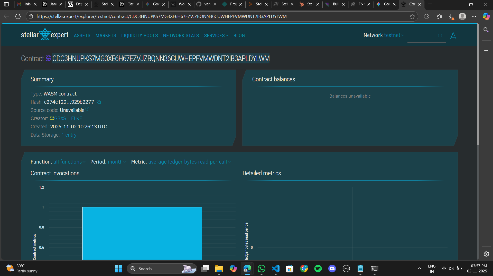

# Stellar Time-Lock Savings Account

## Table of Contents
- [Project Title](#project-title)
- [Project Description](#project-description)
- [Project Vision](#project-vision)
- [Key Features](#key-features)
- [Future Scope](#future-scope)
- [Installation & Setup](#installation--setup)
- [Smart Contract Functions](#smart-contract-functions)
- [Usage Examples](#usage-examples)

## Project Title
**Stellar Time-Lock Savings Account**

## Project Description
The Stellar Time-Lock Savings Account is a decentralized smart contract built on the Stellar blockchain using Soroban SDK. This contract enables users to create savings accounts with time-locked deposits, promoting disciplined savings habits by preventing early withdrawals. Users can deposit funds that remain locked for a specified duration, after which they can withdraw their savings. This mechanism encourages long-term financial planning and helps users achieve their savings goals without the temptation of premature access to their funds.

The smart contract provides a trustless and transparent way to enforce savings commitments, eliminating the need for traditional banking intermediaries while leveraging blockchain security and immutability.

## Project Vision
Our vision is to revolutionize personal finance management on the blockchain by providing a trustless, transparent, and secure savings mechanism. We aim to empower individuals worldwide to take control of their financial future through disciplined savings, leveraging the security and efficiency of the Stellar network. 

By combining blockchain technology with proven savings strategies, we aspire to create a global ecosystem where financial discipline and wealth accumulation become accessible to everyone, regardless of their location or financial background. We believe that by removing barriers to committed savings and providing transparent, automated enforcement, we can help millions of people achieve their financial goals and build lasting wealth.

## Key Features

### 1. **Time-Locked Deposits**
Users can create savings accounts with customizable lock periods, ensuring funds remain untouched until the specified time expires. This feature promotes commitment to long-term savings goals and helps users resist the temptation of premature withdrawals.

### 2. **Secure Fund Management**
The smart contract ensures that only the account owner can create and withdraw from their savings account, with built-in authentication mechanisms (`require_auth()`) to prevent unauthorized access and protect user funds.

### 3. **Transparent Tracking**
Users can view their account details at any time, including the locked amount, unlock timestamp, and withdrawal status, ensuring complete transparency throughout the savings period. This visibility helps users stay committed to their goals.

### 4. **Automated Enforcement**
The contract automatically enforces the lock period, preventing any withdrawals before the designated unlock time. This eliminates the need for manual oversight or third-party intervention, making the system truly autonomous.

### 5. **Immutable Records**
All transactions and account states are recorded on the Stellar blockchain, providing an immutable audit trail and ensuring the integrity of savings commitments. Once committed, the terms cannot be altered.

### 6. **Single Account Protection**
Each address can only create one savings account, preventing confusion and ensuring clear tracking of commitments. This design choice promotes focused savings goals.

### 7. **Withdrawal Status Tracking**
The contract tracks whether funds have been withdrawn, preventing double withdrawals and maintaining accurate account states throughout the lifecycle of the savings account.

## Future Scope

### 1. **Interest Accumulation**
Implement a feature to calculate and distribute interest on locked deposits, incentivizing users to save for longer periods and increasing their returns. Integration with Stellar's native asset capabilities could enable competitive interest rates.

### 2. **Flexible Lock Extensions**
Allow users to extend their lock periods voluntarily, enabling them to adjust their savings strategy as their financial goals evolve without creating new accounts.

### 3. **Multi-Beneficiary Support**
Enable users to designate beneficiaries who can access funds under specific conditions, creating a foundation for inheritance planning and emergency access protocols.

### 4. **Goal-Based Savings**
Introduce multiple savings goals per user, allowing them to create separate time-locked accounts for different objectives such as education, home purchase, retirement, or emergency funds.

### 5. **Emergency Withdrawal Mechanism**
Implement a penalty-based early withdrawal option for genuine emergencies, balancing flexibility with the commitment to long-term savings. Penalties could be redistributed to other savers or burned.

### 6. **Integration with DeFi Protocols**
Connect the time-locked savings with decentralized finance protocols to enable users to earn yield on their locked funds while maintaining the time-lock security, maximizing returns without compromising commitment.

### 7. **Social Savings Features**
Create group savings functionality where multiple users can contribute to a shared time-locked pool for collective goals, community projects, or social savings circles (like ROSCAs).

### 8. **Analytics Dashboard**
Develop comprehensive analytics to help users track their savings patterns, compare performance metrics, and receive personalized recommendations for optimizing their savings strategy based on behavioral data.

### 9. **Recurring Deposits**
Enable automated recurring deposits to savings accounts, allowing users to build savings habits through regular contributions without manual intervention.

### 10. **Multi-Asset Support**
Expand beyond native Stellar lumens to support various Stellar assets, enabling users to save in stablecoins or other tokens of their choice.

## Installation & Setup

### Prerequisites
- Rust installed on your system
- Soroban CLI tools
- Stellar account with test tokens (for testnet)

### Build Instructions
```bash
# Clone the repository
git clone <repository-url>
cd stellar-timelock-savings

# Build the contract
soroban contract build

# Optimize the contract
soroban contract optimize --wasm target/wasm32-unknown-unknown/release/timelock_savings.wasm

# Deploy to testnet
soroban contract deploy \
  --wasm target/wasm32-unknown-unknown/release/timelock_savings.wasm \
  --source <your-secret-key> \
  --network testnet
```

## Smart Contract Functions

### `create_account`
Creates a new time-locked savings account.

**Parameters:**
- `owner: Address` - The account owner's address
- `amount: i128` - Amount to lock (must be > 0)
- `lock_duration: u64` - Duration in seconds to lock funds

**Requirements:**
- Owner must authenticate
- No existing account for the address
- Amount must be positive

### `withdraw`
Withdraws funds after the lock period expires.

**Parameters:**
- `owner: Address` - The account owner's address

**Returns:** `i128` - The withdrawn amount

**Requirements:**
- Owner must authenticate
- Account must exist
- Lock period must have expired
- Funds must not have been withdrawn already

### `view_account`
Retrieves account details for any address.

**Parameters:**
- `owner: Address` - Address to query

**Returns:** `SavingsAccount` - Account details or default values if not found

### `get_total_accounts`
Returns the total number of savings accounts created.

**Returns:** `u64` - Total account count

## Usage Examples

### Creating a Savings Account
```bash
# Lock 1000 tokens for 30 days (2,592,000 seconds)
soroban contract invoke \
  --id <contract-id> \
  --source <your-secret-key> \
  --network testnet \
  -- create_account \
  --owner <your-address> \
  --amount 1000 \
  --lock_duration 2592000
```

### Viewing Account Details
```bash
soroban contract invoke \
  --id <contract-id> \
  --network testnet \
  -- view_account \
  --owner <address>
```

### Withdrawing Funds
```bash
# After lock period expires
soroban contract invoke \
  --id <contract-id> \
  --source <your-secret-key> \
  --network testnet \
  -- withdraw \
  --owner <your-address>
```

### Checking Total Accounts
```bash
soroban contract invoke \
  --id <contract-id> \
  --network testnet \
  -- get_total_accounts
```

---

## License
This project is open source and available under the MIT License.

## Contributing
Contributions are welcome! Please feel free to submit pull requests or open issues for bugs and feature requests.

## Contact
For questions or support, please open an issue in the repository.

---CONTRACT DETAILS
CONTRACT ID -CDC3HNUPKS7MG3XE6H67EZVJZBQNN36CUWHEPFVMWDNT2IB3APLDYLWM



**Built with ❤️ using Soroban SDK on the Stellar Blockchain**